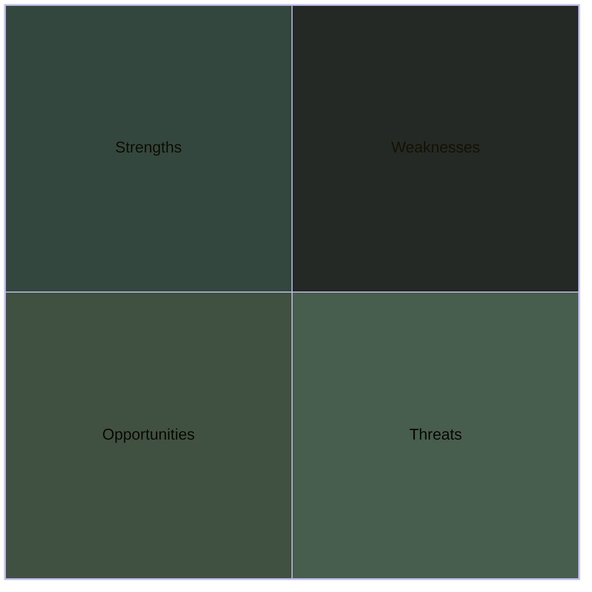

SWOT stands for Strengths, Weaknesses, Opportunities and Threats.  It can be a very useful exercise to help you decide on your personal development priorities.

In this exercise, we set aside some time to be honest with ourselves about where we currently are, who you want to be, and where you need to go.  We create a canvas to help with this and as we consider each of the sections of the canvas, we add post-it notes to them.

Once you have completed your SWOT analysis, look for any development areas or goals.  Any identified can be added to the relevant section of your [[Goals Board.canvas|Goals Board]]
## Strengths
What are your current strengths.  What are you really good at?  What would you consider yourself an expert in?
How can we use these strengths to help us achieve our goals?
## Weaknesses
What areas are you not as strong in?  Where do you need to grow or what do you need to get better at?
How can we improve these areas so they are no longer a weakness?
## Opportunities
What are the current options or opportunities you have available to you?  Do you have access to any training resources?  Anyone you know that could give you some guidance?
How can we maximise the opportunities in front of us?
## Threats
What are the dangers or threats that you can see that may prevent you from getting to where you need to go or becoming who you want to be?  
What can you do to negate these threats or minimise their potential impact? 

