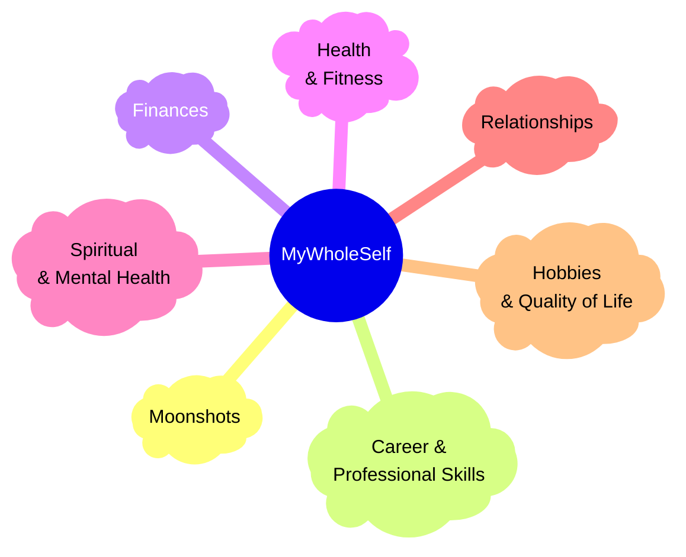

## What do we mean by My Whole Self?
When you are considering what goals you want to set, it is important that you consider all aspects of your life.  The [[Goals Board.canvas|Goals Board]] has sections dedicated to all areas of your life, from Relationships through to Mental Health to your Career & Professional Skills.  It can be easy to focus too much on your Career goals and forget about your personal goals and dreams.  The [[Goals Board.canvas|Goals Board]] is designed to keep your personal goals in balance with your Career aspirations.
### My Whole Self Goals Board sections
The My Whole Self sections of the [[Goals Board.canvas|Goals Board]] are:
- [[Visualising your Goals#Moonshots|:LiMoon: Moonshots]]
- [[Visualising your Goals#Career & Professional Skills|:LiBriefcase: Career & Professional Skills]]
- [[Visualising your Goals#Finances|:LiCoins: Finances]]
- [[Visualising your Goals#Health & Fitness|:LiApple: Health & Fitness]]
- [[Visualising your Goals#Spiritual & Mental Health|:LiBrain: Spiritual & Mental Health]]
- [[Visualising your Goals#Relationships|:LiHeart: Relationships]]
- [[Visualising your Goals#Hobbies & Quality of Life|:LiFlower2: Hobbies & Quality of Life]]
When you are thinking about the goals you want to set for your Whole Self, it is important to think of each of these areas.  Try to ensure you have at least 2 goals for each of the sections in [[My Whole Self#My Whole Self Goals Board sections|My Whole Self]].
### What do you want to achieve?
Before you start though, it is important to give some consideration to the larger question.  What is it that you want to achieve in your life?  What is important to you?  What does living a successful life mean to you?
It may be helpful to consider writing a [[Personal Mission Statement]], a [[Personal Mission Statement]] or just selecting your [[Personal Values]].  Understanding how you want to live, where you want to get to and what values you hold dear may help to shape your goal setting.
The most important thing is to be the true you, no masks.
## Understand what is important to you
Set aside some time to go through each of the sections in [[My Whole Self#My Whole Self Goals Board sections|My Whole Self]] and consider, what in that area causes you the most happiness[^1] and what causes you the most stress[^2]

## Visualising your happiness and stress
|                                            | <h1>**:LiAngry:**</h1> | <h1>**:LiFrown:**</h1> | <h1>**:LiMeh:**</h1> | <h1>**:LiSmile:**</h1> | <h1>**:LiLaugh:**</h1> |
| ------------------------------------------ | ---------------------- | ---------------------- | -------------------- | ---------------------- | ---------------------- |
| :LiMoon: Moonshots                         |                        |                        |                      |                        |                        |
| :LiBriefcase: Career & Professional Skills |                        |                        |                      |                        |                        |
| :LiCoins: Finances                         |                        |                        |                      |                        |                        |
| :LiApple: Health & Fitness                 |                        |                        |                      |                        |                        |
| :LiBrain: Spiritual & Mental Health        |                        |                        |                      |                        |                        |
| :LiHeart: Relationships                    |                        |                        |                      |                        |                        |
| :LiFlower2: Hobbies & Quality of Life      |                        |                        |                      |                        |                        |

[^1]: Read the [[Happiness Heart]] section
[^2]: Read the [[Stress Container]] section