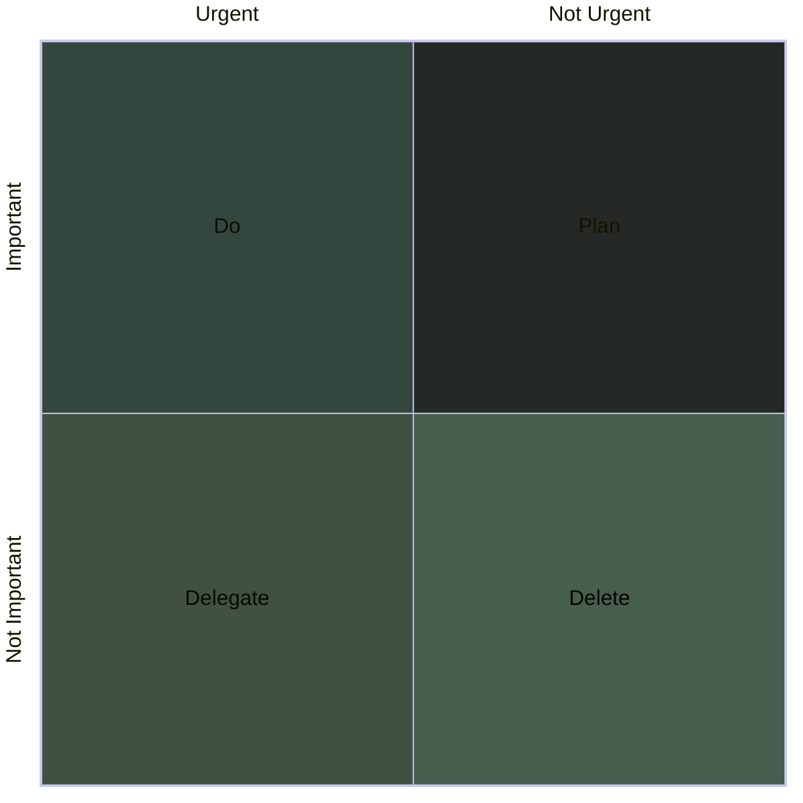

## How it works
Organize your task list into four separate quadrants, sorting them by important vs. unimportant and urgent vs. not urgent, as shown in the graphic below. Urgent tasks are those we feel need to get done immediately. Important tasks are those that contribute to your long term goals or values. Ideally, you should only work on tasks in the top two quadrants—the other tasks, you should delegate or delete.

## Do
### Both Urgent & Important
These are urgent and important tasks that you should focus on.  Some examples of the types of tasks that will fall into this category are:
## Plan
### Not urgent, but Important
These tasks are important, but do not have the urgency of a [[#Do - Both Urgent & Important|Do]] task.  You should look to plan when these can be completed into your schedule
## Delegate
### Urgent but not important
These tasks are often the ones you should be delegating to others, or tackling after you have handled all the [[#Do]] tasks if there is no one else to delegate them too.
## Delete
### Not urgent or important
These tasks do not need your attention, and will potentially distract you from the more important tasks.  The best way forwards is to remove them from your to-do list completely by deleting them.
